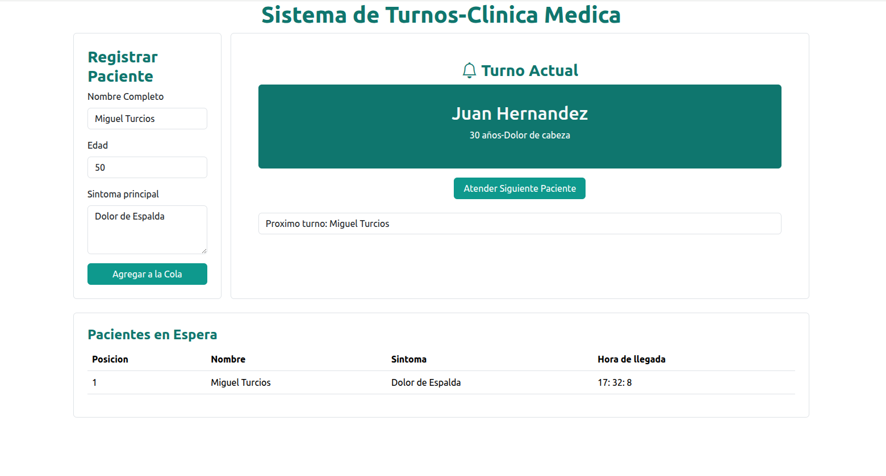

# Sistema de Turnos Clínicos 🏥

Este proyecto es una aplicación web simple desarrollada con **HTML**, **CSS** y **JavaScript**, que simula un **sistema de turnos para pacientes en una clínica médica**. Utiliza una **estructura de datos tipo cola (Queue)** para gestionar los pacientes de forma ordenada según su llegada.

---

## 🧠 Funcionalidad

El sistema permite:

- **Registrar pacientes** ingresando nombre, edad y síntoma principal.
- **Asignar un turno** de atención a cada paciente en orden de llegada.
- **Visualizar el paciente actual** que está siendo atendido.
- **Anunciar el turno actual** mediante síntesis de voz.
- **Mostrar al siguiente paciente** en la fila de espera.
- **Mantener un historial** de los pacientes que esperan.

---

## 🛠️ Características técnicas

- **Estructura tipo cola (Queue):** cada nuevo paciente se agrega al final de la fila.
- **Clase Node:** representa a un paciente con nombre, edad, síntoma, hora de registro y referencia al siguiente paciente.
- **Clase Queue:** contiene métodos para agregar pacientes (`enqueue`), atender al siguiente paciente (`dequeue`), ver el paciente actual (`peek`) y mostrar el historial (`printQueue`).
- **Hora automática:** registra la hora exacta en que se añadió el paciente.
- **Síntesis de voz:** avisa al paciente cuando es su turno mediante el API de `SpeechSynthesis`.

---

## 🖼️ Interfaz

- Formulario de ingreso de datos: nombre, edad y síntomas.
- Botón para agregar paciente a la fila.
- Sección que muestra:
  - Paciente actual.
  - Próximo paciente.
  - Tabla con el historial de espera.

---

## 📂 Estructura del proyecto

